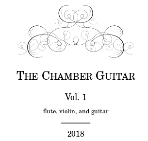

  

<i>The Chamber Guitar</i> is an anthology of scores for classical music ensembles
that contain at least one guitar part. While there are a number of books of flute
and guitar music available commercially, there is little for ensembles larger than
the duet, and it is hoped that <i>The Chamber Guitar</i> will contribute to a
reduction of that scarcity.

The scores were engraved  with <i>Lilypond</i>, the award-winning open source music
engraving software.  Lilypond is more like a programming language than a desktop
music program; you write text files containing the likes of this: 
 

g4  r8 d g4 r8 d |  
g d g b d4 r |  

 
and the Lilypond 'compiler' turns this <i>source code</i> into a finished music score:
 
 

A quick comparison of the source code with the graphic snippet shows the basic principles
at work. The 'g'in the 'g4' first term is the note pitch, and the '4' is the duration
indicator - a quarter note. Next comes an eighth-note rest ('r8') and so on.
An important point is that Lilypond takes care of all standard spacing and formatting;
you need only specify the music.

 

    

The source code files are included  in this repository, allowing
you to reproduce the scores and make changes and modifications to them under the 
terms of the Creative Commons Public License (Attribution-ShareAlike 4.0)

<h2>Cloning the repository</h2>
On your system: 
<code>
git clone https://github.com/ChamberGuitarists/Scores.git
</code>
 
<code>
cd Scores
</code>

 

